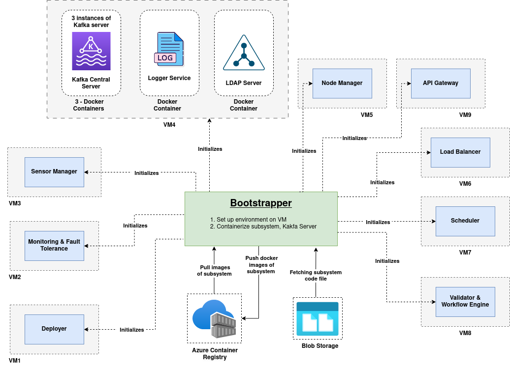

# Distributed IoT Based App Development Platform

## Overview of Platform

The Distributed IoT Platform is a comprehensive Platform as a Service (PaaS) solution designed to simplify the deployment, management, and monitoring of IoT applications across distributed environments. It provides developers with a robust ecosystem for building, deploying, and scaling their IoT applications while abstracting away the complexities of distributed systems management.

### Platform Summary

1. **Simplified Deployment**: The platform allows developers to easily deploy, scale, monitor, and execute their IoT-based applications without worrying about the underlying infrastructure.

2. **IoT Device Integration**: Seamless integration with various IoT devices and sensors, providing a unified interface for data collection and device management.

3. **Scalable Architecture**: Applications can be deployed across multiple containers based on scalability requirements, with built-in support for load balancing across multiple VM instances.

4. **Fault Tolerance**: Comprehensive monitoring and fault tolerance capabilities ensure that if any instance of a subsystem goes offline, the system automatically deploys a new instance, ensuring continuous operation.

5. **Centralized Management**: A unified dashboard for monitoring application performance, resource utilization, and system health.

### Actors of Platform

1. **App Developer**: Creates and deploys IoT applications on the platform
2. **Platform Admin**: Manages the platform infrastructure and resources
3. **Platform Developer**: Extends and enhances the platform capabilities

### User Journey for App Developers

1. **Registration**: App developers register on the platform to gain access to development resources.

2. **Contract Download**: Developers download the platform contracts and guidelines that specify the format and requirements for application deployment.

3. **Application Upload**: Developers upload their codebase through the platform's user interface.

4. **Deployment Scheduling**: Developers schedule the deployment time for their application through the deployment process page.

5. **Application Access**: Once deployment is complete, developers receive a link to access their deployed application.

## Detailed Information About the Platform

### Technology Stack

1. **Backend**: Python for microservices development
2. **Messaging**: Apache Kafka for event-driven communication between services
3. **Containerization**: Docker for application packaging and deployment
4. **Web Framework**: Flask/FastAPI for API development
5. **Frontend**: React.js for user interfaces

### Database and Storage

1. **Document Database**: MongoDB for flexible schema storage
2. **Object Storage**: Blob storage for application artifacts and large files
3. **Container Registry**: Azure Container Registry for Docker image management

### Core Subsystems

1. **Bootstrapper**: Initializes the platform and orchestrates the deployment of other services
2. **Application Controller**: Combines Scheduler and Validator Workflow for application lifecycle management
3. **Deployer**: Handles the actual deployment of applications to nodes
4. **Node Manager & Load Balancer**: Manages node resources and distributes traffic
5. **Sensor Manager**: Handles sensor registration, data collection, and processing
6. **Monitoring and Fault Tolerance**: Tracks system health and implements recovery mechanisms
7. **Logger**: Centralized logging service for all platform components
8. **Platform UI**: User interface for platform interaction

### Supporting Modules

1. **API Gateway**: Central entry point for all client requests
2. **LDAP Authentication Server**: Handles user authentication and authorization
3. **Logger UI**: Visual interface for log analysis and troubleshooting

### Platform Architecture



### System Diagrams

1. **[Bootstrapper]**: Initialization and orchestration of platform services
2. **[Deployer]**: Application deployment workflow and process
3. **[Communication Model]**: Inter-service communication patterns
4. **[Application Model]**: Application structure and components
5. **[Packaging Model]**: Application packaging and distribution
6. **[Application Controller]**: Application lifecycle management
7. **[Sensor Manager]**: Sensor data processing pipeline
8. **[Node Manager]**: Node resource management
9. **[Monitoring and Fault Tolerance]**: System monitoring and recovery mechanisms

## Getting Started

### Prerequisites

- Docker and Docker Compose
- Python 3.8+
- Multiple nodes (physical or virtual machines) for distributed deployment

### Installation

1. Clone the repository:
   ```bash
   git clone https://github.com/msaisridattaDev/Distributed-IOT-Platform.git
   cd Distributed-IOT-Platform
   ```

2. Configure node information:
   - Update the node details in `Bootstrapper/node_info.py`
   - Ensure SSH access is properly configured between nodes

3. Start the bootstrapper:
   ```bash
   cd Bootstrapper
   python main.py
   ```

4. The bootstrapper will initialize the platform and deploy all necessary services across the configured nodes.

## Contributing

Contributions to the Distributed IoT Platform are welcome! Please feel free to submit pull requests, create issues, or suggest improvements.

## License

This project is licensed under the MIT License - see the LICENSE file for details.
